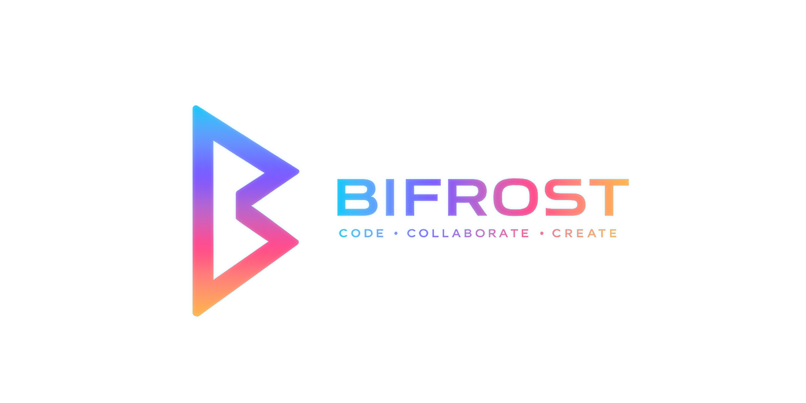

  

<h1 align="center">BIFROST</h1>

  A self-hosted Git platform for repositories, issues, pull requests, CI/CD, packages, teams, and developer workflows.

  
  
  

---

## Vision

BIFROST is an in-progress Git platform designed to bring the core developer workflow into one cohesive, self-hosted workspace.

The goal is to make repository hosting, code review, automation, packages, teams, realtime collaboration, desktop tooling, and AI-assisted summaries feel like one connected system instead of a patchwork of separate tools.

## Planned Capabilities

- Repository hosting and project organization
- Issues, pull requests, reviews, and team workflows
- CI/CD pipelines powered by BIFROST Runner
- Package hosting and release management
- Realtime updates for collaboration-heavy workflows
- Windows and Linux desktop app
- AI-generated commit and pull request summaries
- Self-hosted deployment with Docker, OpenLiteSpeed, and Cloudflare-ready infrastructure

## Planned Stack

| Area | Technologies |
| --- | --- |
| Web | Next.js, React, TypeScript, Tailwind CSS |
| API | CodeIgniter 4, PHP 8.4 |
| Realtime | Node.js, Socket.IO, Redis |
| Database | MariaDB |
| Storage | Cloudflare R2 |
| Infrastructure | Docker, OpenLiteSpeed, Cloudflare |
| Automation | BIFROST Runner |
| Desktop | Windows and Linux app |
| AI | Commit and pull request summaries |

## Planned Repositories

| Repository | Purpose |
| --- | --- |
| `bifrost-web` | Web application and user interface |
| `bifrost-api` | Backend API and core platform logic |
| `bifrost-realtime` | Realtime events, notifications, and collaboration |
| `bifrost-runner` | CI/CD runner and job execution |
| `bifrost-desktop` | Desktop app for Windows and Linux |
| `bifrost-sdk` | SDKs and integration helpers |
| `bifrost-ui` | Shared design system and UI components |
| `bifrost-infra` | Deployment and infrastructure configuration |
| `bifrost-docs` | Product and developer documentation |
| `bifrost-design` | Brand, design files, and visual assets |

## Project Status

BIFROST is currently in the planning and early foundation phase. Public repositories, implementation details, and documentation will be added as the platform takes shape.
